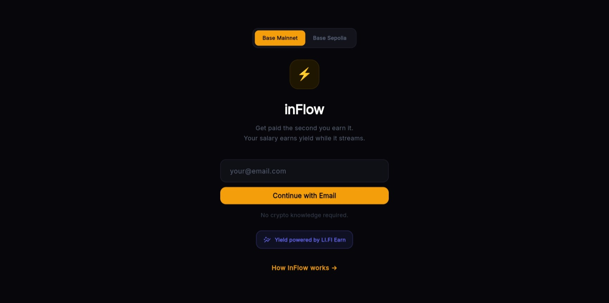
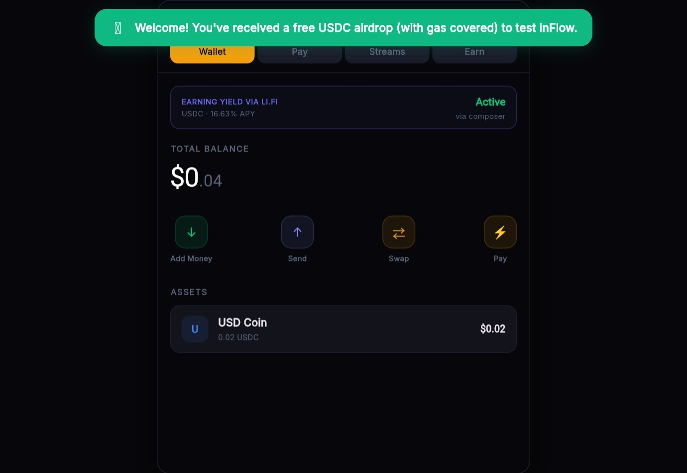
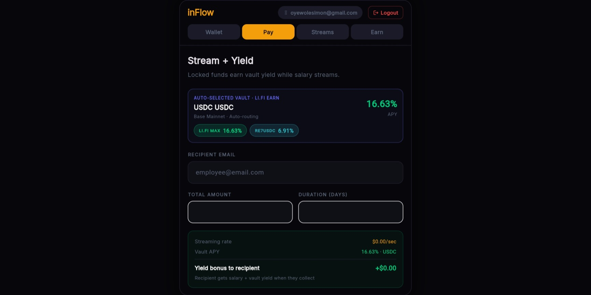
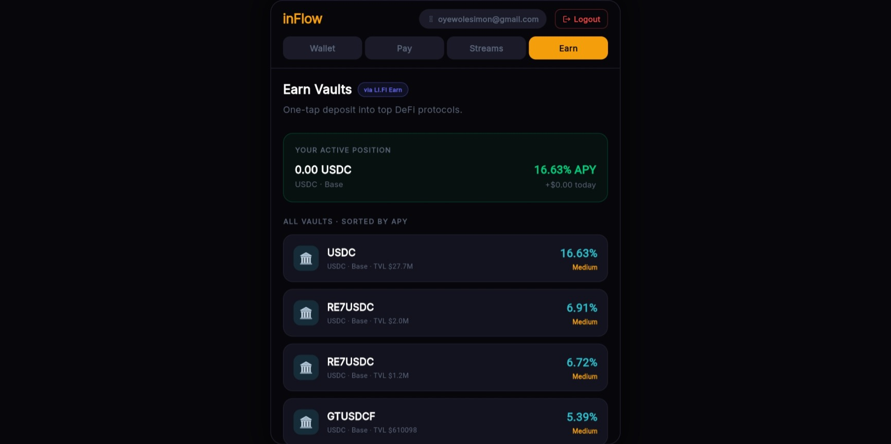

# ⚡ inFlow × LI.FI Earn

> **Get paid by the second. Your salary earns vault yield while it streams.**

[](https://base.org)
[](https://docs.li.fi/earn/overview)
[](https://privy.io)
[](https://t.me/lifibuilders)
[](#)

---

<div align="center">

**[🚀 Live App](https://useInflow.web.app/how-it-works) · [📹 Demo Video](#demo) · [📖 How It Works](#how-it-works)**

</div>

---

## The Problem

Across Africa, delayed wages are an epidemic. An employee works for 30 days, hands over their full labour, and waits — hoping their employer pays on time, in full, at all. The ILO has formally described wage debt as *"another African epidemic."*

**93% of Nigeria's workforce has no formal wage contract.** No receipts. No proof. No legal recourse.

But there's a second, quieter problem: when an employer *does* lock funds for salary, that capital sits **completely idle** until payday. A 1,000 USDC salary budget locked for 30 days earns exactly $0 for 29 days.

inFlow solves both.

---

## What Is inFlow?

inFlow is a **yield-boosted salary streaming app** built for the 3 billion people who have a smartphone and an email address but no bank account or crypto wallet.

**For employers**: Lock a salary budget → funds auto-deposit into the best LI.FI Earn vault (Morpho, Aave, Euler) → send a payment link → done.

**For employees**: Open a link → sign in with email → watch your salary tick up per-second → collect anytime. No wallet. No seed phrase. No crypto knowledge.

The blockchain is entirely invisible. The trust is entirely real.

---

## How It Works

### 1 — Employer signs in with email
No wallet setup. No seed phrase. No browser extension. Just an email address. [Privy](https://privy.io) creates a secure, non-custodial EVM wallet on Base silently in the background. You own the keys — you just never have to see them.

### 2 — Salary budget auto-deposits into LI.FI Earn vault
The moment a stream is created, the full salary budget is deposited into the best available vault via the **LI.FI Earn API**. The API scans 20+ protocols (Morpho Blue, Aave v3, Euler, Pendle, Ethena) across 60+ chains and selects the optimal USDC vault by APY and risk profile — currently yielding 5–9% APY on Base.

The idle capital that used to do nothing now works from the first second.

### 3 — Salary streams per-second to the employee
A smart contract on Base releases the employee's allocation continuously — by the second. If you've worked 12 of 30 days, exactly 40% of your salary is claimable *right now*. No asking. No approval. No waiting.

### 4 — Employee opens the link, signs in with email
The employer sends a unique payment link (looks like a normal URL). Employee opens it from any device, enters their email, and a wallet is created automatically. They land on a dashboard showing their earnings ticking upward in real time.

### 5 — Collect salary + vault yield, any time
When the employee hits "Collect Earnings," the LI.FI Earn API redeems their proportional vault shares. They receive their vested salary **plus the accumulated vault yield** — a bonus they never had to think about or manage. One tap. Instant settlement on Base.

---

## The DeFi Mullet Explained

> *"Business up front, party in the back."*

The user sees a one-click "Collect Earnings" button. Behind it:

```
User taps "Collect" →
  LI.FI Earn API: calculate vested shares
  LI.FI Earn API: redeem USDC from Morpho vault
  Stream contract: verify elapsed time
  Base: settle USDC to employee wallet
  ← User sees "$847.33 arrived" ✓
```

No protocol-hopping. No bridging. No gas management. **One button. Full DeFi infrastructure.**

---

## LI.FI Earn Integration

inFlow uses three LI.FI Earn API endpoints:

| Endpoint | Usage |
|----------|-------|
| `GET /v1/vaults` | On stream creation — find best vault by chain, token, APY |
| `POST /v1/composer/deposit` | Lock employer's salary budget into vault (swap + deposit, 1 tx) |
| `POST /v1/composer/withdraw` | Employee collects earnings — redeem vault shares for USDC |

```js
// 1. Find best vault on Base for USDC
const vaults = await fetch('https://earn.li.fi/v1/vaults?chainId=8453');
const best = vaults
  .filter(v => v.token.symbol === 'USDC')
  .sort((a, b) => b.apy - a.apy)[0];
// → Morpho Blue USDC · 6.2% APY · $48M TVL

// 2. Deposit on stream creation (one-click via Composer)
await fetch('https://earn.li.fi/v1/composer/deposit', {
  method: 'POST',
  body: JSON.stringify({
    vaultAddress: best.address,
    chainId: 8453,
    amount: '1000000000', // 1000 USDC
    fromAddress: employerWallet,
    tokenAddress: USDC_BASE,
  })
});

// 3. Employee collects — redeem proportional shares
await fetch('https://earn.li.fi/v1/composer/withdraw', {
  method: 'POST',
  body: JSON.stringify({
    vaultAddress: best.address,
    amount: vestedShares,
    toAddress: employeeWallet,
  })
});
```

---

## Features

| Feature | Status |
|---------|--------|
| Email login (no wallet required) | ✅ Live |
| Wallet auto-creation via Privy | ✅ Live |
| Real-time per-second earning ticker | ✅ Live |
| Payment link sharing | ✅ Live |
| LI.FI Earn vault deposit on stream creation | ✅ Live |
| Live APY display on stream form | ✅ Live |
| Yield + salary combined collection | ✅ Live |
| Earn tab — browse & deposit into vaults directly | ✅ Live |
| Yield-to-recipient toggle | ✅ Live |
| Stream cancellation with proportional refund | ✅ Live |
| USDC / ETH / STRK support | ✅ Live |
| Base Mainnet + Sepolia testnet | ✅ Live |
| Free USDC for new testnet users | ✅ Live |

---

## Tech Stack

```
Frontend     Flutter Web (Dart) — deployed on Firebase Hosting
Auth         Privy — email OTP → non-custodial EVM wallet on Base
Yield        LI.FI Earn API — vault discovery, deposit, withdrawal
Chain        Base (EVM) — low fees, fast finality
Relay        Cloudflare Workers — stream secrets, faucet, metadata
Streaming    Custom escrow contract on Base
```

---

## Demo

> 📹 **[Watch the full demo →](#)**

### Screenshots

#### 🏠 Landing


#### 💸 Stream + Yield


#### 📊 My Streams


#### 🏦 Earn Vaults


---

## Try It

**Mainnet**: [useinflow.web.app](https://useinflow.web.app/how-it-works)

**Mainnet (free USDC)**:
1. Go to [useinflow.web.app](https://useinflow.web.app/how-it-works)
2. Switch to **Base Mainnet** in the top toggle
3. Sign in with any email
4. Receive free test USDC automatically
5. Create a salary stream → it auto-deposits into a LI.FI vault
6. Send the payment link to a friend (or a second email of yours)
7. Watch earnings tick up per-second, then collect salary + yield

---

## Why It Matters

Africa has the world's fastest-growing workforce and some of its most vibrant freelance ecosystems. What it has lacked is infrastructure that treats workers as first-class citizens — not as creditors extending zero-interest loans to their employers every month.

inFlow is built on the belief that money should move at the speed of work. And with LI.FI Earn, even the capital sitting in escrow works at the speed of DeFi.

> *"Your labour is not a loan. And now, neither is your employer's capital."*

---

## Hackathon Submission

- **Event**: DeFi Mullet Hackathon #1 — Builder Edition
- **Track**: 🎨 DeFi UX Challenge | Open Track
- **API Used**: [LI.FI Earn](https://docs.li.fi/earn/overview) — vault discovery, Composer deposit, Composer withdraw
- **Chain**: Base Mainnet + Sepolia

---

## Built With

- [LI.FI Earn API](https://docs.li.fi/earn/overview)
- [Privy](https://privy.io) — embedded wallets
- [Base](https://base.org) — EVM L2
- [Cloudflare Workers](https://workers.cloudflare.com)
- [Flutter Web](https://flutter.dev)

---

<div align="center">
  <strong>Built for DeFi Mullet Hackathon #1 · April 2026</strong><br>
  <sub>⚡ inFlow — salary infrastructure for the next billion</sub>
</div>
